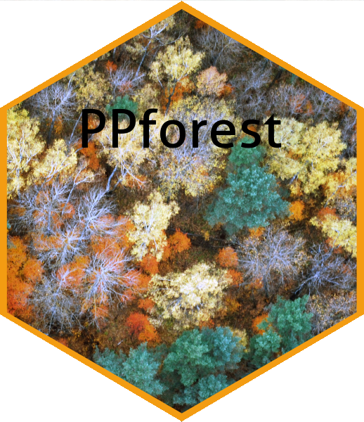

`PPforest` package
======================
Natalia da Silva, Dianne Cook & Eun-Kyung Lee 





[]( https://CRAN.R-project.org/package=PPforest)[](https://cran.r-project.org/package=PPforest) [](https://www.r-pkg.org/pkg/PPforest)


Introduction
============


The `PPforest` package (projection pursuit random forest) contains functions to run a projection pursuit random forest for classification problems. This method utilize combinations of variables in each tree construction.  In a random forest each split is based on a single variable, chosen from a subset of predictors. In the `PPforest`, each split is based on a linear combination of randomly chosen variables. The linear combination is computed by optimizing a projection pursuit index, to get a projection of the variables that best separates the classes. The `PPforest` uses the `PPtree` algorithm, which fits a single tree to the data. Utilizing linear combinations of variables to separate classes takes the correlation between variables into account, and can outperform the basic forest when separations between groups occurs on combinations of variables. Two projection pursuit indexes, LDA and PDA, are used for `PPforest`.

To improve the speed performance `PPforest` package, `PPtree` algorithm was translated to Rcpp. 
`PPforest` package utilizes a number of R packages some of them included in "suggests" not to load them all at package start-up.

The development version of`PPforest` can be installed from github using:


`library(devtools)`

`install_github("natydasilva/PPforest")`

`library(PPforest)`


Overview PPforest package
-------------------------

`PPforest` package implements a classification random forest using projection pursuit classification trees. The following table present all the functions in `PPforest` package.

| Function |Description |
| ----------------- | --------------------------------------------------------------  | 
|baggtree|For each bootstrap sample grow a projection pursuit tree (PPtree object).|
|node_data|Data structure with the  projected and boundary by node and class|
|permute_importance|Obtain the permuted importance variable measure|
|ppf_avg_imp| Computes a global importance measure for a PPforest object, average importance measure for a pptree over all the trees.| 
|PPclassify| Predict class for the test set and calculate prediction error after finding the PPtree structure|
|ppf_global_imp| Computes a global importance measure for a PPforest object|
|PPforest|Runs a Projection pursuit random forest|
|PPtree_split|Projection pursuit classification tree with random variable selection in each split|
|print.PPforest| Print PPforest object|
|predict.PPforest|Predict a PPforest object for newdata|
|ternary_str|Data structure with the projected and boundary by node and class|
|tree_pred|Obtain predicted class for new data using PPforest t.|

Also `PPforest` package includes some data set that were used to test the predictive performance of our method. The data sets included are: crab, fishcatch, glass, image, leukemia, lymphoma NCI60, parkinson and wine.

 Example
------------
Australian crab data set will be used as example. This data contains measurements on rock crabs of the genus Leptograpsus. There are 200 observations from two species (blue and orange) and for each specie (50 in each one) there are 50 males and 50 females. Class variable has 4 classes with the combinations of specie and sex (BlueMale, BlueFemale, OrangeMale and OrangeFemale). The data were collected on site at Fremantle, Western Australia. For each specimen, five measurements were made, using vernier calipers.

1. FL the size of the frontal lobe length, in mm
2. RW rear width, in mm
3. CL length of mid line of the carapace, in mm
4. CW maximum width of carapace, in mm
5. BD depth of the body; for females, measured after displacement of the abdomen, in mm


`PPforest` function runs a projection pursuit random forest.The arguments are a `data` a data.frame object with the data information, `y` a character with the name of the class variable.  `size.tr` 
to specify the proportion of observations using in the training. Using this function we have the option to split the data in training and test internally in the forest and the PPforest object reports both errors. `size.tr` is the proportion of data used in the training and the test proportion will be 1- `size.tr`.
The number of trees in the forest is specified using the argument `m`. The argument `size.p` is the sample proportion of the variables used in each node split, `PPmethod` is the projection pursuit index to be optimized,  two options LDA and PDA are available.
The algorithm can be parallelized using `parallel` and `cores` arguments. 
```r 
set.seed(123)
pprf.crab <- PPforest::PPforest(data = crab, y = "Type", size.tr = 0.7, m = 200,
                                size.p =  .5,  PPmethod = 'LDA',  parallel =TRUE, cores = 2)

pprf.crab


Call:
 PPforest(data = crab, y = "Type", xstd = "no", size.tr = 1, m = 3,  PPmethod = "LDA", size.p = 1, parallel = TRUE, cores = 2,      rule = 1) 
               Type of random forest: Classification
                     Number of trees: 3
No. of variables tried at each split: 5

        OOB estimate of  error rate: 26.5%
Confusion matrix:
             BlueFemale BlueMale OrangeFemale OrangeMale class.error
BlueFemale           48        2            0          0        0.04
BlueMale             21       29            0          0        0.42
OrangeFemale         14        0           33          3        0.34
OrangeMale           13        0            0         37        0.26


```

`PPforest` print a summary result from the model with the confusion matrix information and the oob-error rate in a similar way randomForest packages does.

This function returns the predicted values of the training data, training error, test error and predicted test values. Also there is the information about out of bag error for the forest and also for each tree in the forest. Bootstrap samples, output of all the trees in the forest from , proximity matrix and vote matrix, number of trees grown in the forest, number of predictor variables selected to use for splitting at each node. Confusion matrix of the prediction (based on OOb data), the training data and test data and vote matrix are also returned.

The printed version of a `PPforest` object follows the `randomForest` printed version to make them comparable. Based on confusion matrix, we can observe that the biggest error is for BlueMale class. Most of the wrong classified values are between BlueFemale and BlueMale.

```r
str(pprf.crab, max.level = 1)
List of 28
 $ predicting.training: Factor w/ 4 levels "BlueFemale","BlueMale",..: 2 2 2 2 1 2 2 1 2 1 ...
 $ training.error     : num 0.0571
 $ prediction.test    : Factor w/ 4 levels "BlueFemale","BlueMale",..: 2 2 2 2 2 2 2 2 2 2 ...
 $ error.test         : num 0.0667
 $ oob.error.forest   : num 0.0643
 $ oob.error.tree     : num [1:200, 1] 0.1961 0.0625 0.1429 0.0408 0.1923 ...
 $ boot.samp          :List of 200
 $ output.trees       :List of 200
 $ proximity          : num [1:140, 1:140] 0 0.79 0.735 0.8 0.36 0.825 0.71 0.265 0.46 0.36 ...
 $ votes              : num [1:140, 1:4] 0.243 0.288 0.183 0.235 0.835 ...
  ..- attr(*, "dimnames")=List of 2
 $ prediction.oob     : Factor w/ 4 levels "BlueFemale","BlueMale",..: 2 2 2 2 1 2 2 1 2 1 ...
 $ n.tree             : num 200
 $ n.var              : int 3
 $ type               : chr "Classification"
 $ confusion          : num [1:4, 1:5] 33 4 0 0 2 31 0 1 0 0 ...
  ..- attr(*, "dimnames")=List of 2
 $ call               : language PPforest::PPforest(data = crab, y = "Type", size.tr = 0.7, m = 200, PPmethod = "LDA", size.p = 0.5,      parallel| __truncated__
 $ train              :'data.frame':	140 obs. of  6 variables:
 $ test               :'data.frame':	60 obs. of  6 variables:
 $ vote.mat           : num [1:200, 1:140] 1 2 4 2 2 2 2 4 1 1 ...
  ..- attr(*, "dimnames")=List of 2
 $ vote.mat_cl        : chr [1:4] "BlueFemale" "BlueMale" "OrangeFemale" "OrangeMale"
 $ class.var          : chr "Type"
 $ oob.obs            : num [1:200, 1:140] 0 0 0 0 0 0 1 1 0 1 ...
 $ std                : chr "scale"
 $ dataux             : num [1:140, 1:5] -2.14 -1.71 -1.65 -1.36 -1.28 ...
  ..- attr(*, "dimnames")=List of 2
  ..- attr(*, "scaled:center")= Named num [1:5] 15.5 12.8 32 36.3 14
  .. ..- attr(*, "names")= chr [1:5] "FL" "RW" "CL" "CW" ...
  ..- attr(*, "scaled:scale")= Named num [1:5] 3.47 2.57 7.06 7.84 3.4
  .. ..- attr(*, "names")= chr [1:5] "FL" "RW" "CL" "CW" ...
 $ mincol             : NULL
 $ maxmincol          : NULL
 $ train_mean         : Named num [1:5] 15.5 12.8 32 36.3 14
  ..- attr(*, "names")= chr [1:5] "FL" "RW" "CL" "CW" ...
 $ train_sd           : Named num [1:5] 3.47 2.57 7.06 7.84 3.4
  ..- attr(*, "names")= chr [1:5] "FL" "RW" "CL" "CW" ...
 - attr(*, "class")= chr "PPforest"
```

Since the `PPforest` object was using and internal split we can check the test error as follows

```r
pprf.crab$error.test
[1] 0.06666667
```

We also can split the data outside the forest and fit `PPforest` using a training sample and we should define the argument as `size.tr = 1`. The prediction in the test
data can be donde using the function predict.

```r
 set.seed(123)
 train <- sample(1:nrow(crab), nrow(crab)*.7)
 crab_train <- data.frame(crab[train, ])
 crab_test <- data.frame(crab[-train, ])

 pprf.crab <- PPforest(data = crab_train, class = 'Type',
   std = 'scale', size.tr = 1, m = 200, size.p = .4, PPmethod = 'LDA', parallel = TRUE )
 pred <- predict(pprf.crab, newdata = crab_test[,-1], parallel = TRUE) 
```
